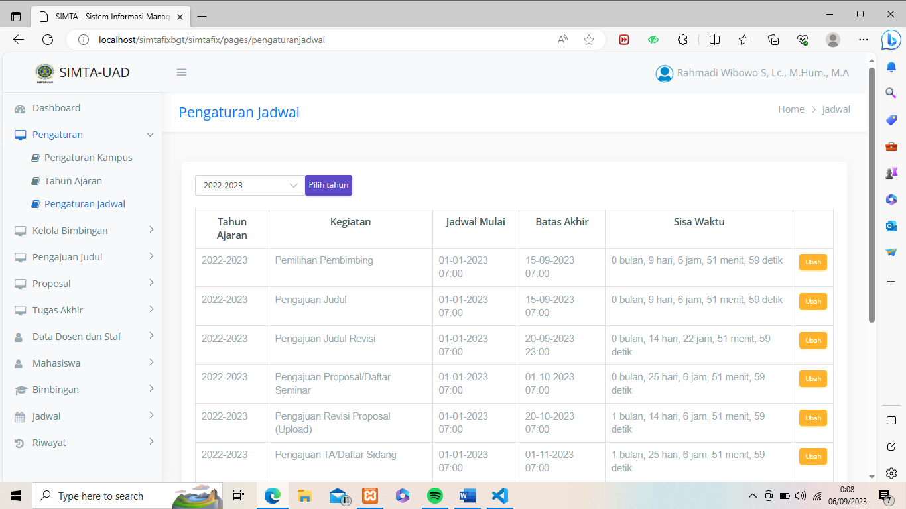

# Sistem-Informasi-Tugas-Akhir-Mahasiswa
Sistem Informasi Tugas Akhir Mahasiswa ini dapat digunakan oleh 5 aktor: Mahasiswa, Dosen, Kaprodi, Staf Prodi, dan Koordinator TA.

To access admin page, add url /admin. Example http://localhost/simtauad/index.php

# Tampilan Aplikasi
## Tampilan Beranda

## Tampilan Login

## Tampilan Homepage

## Tampilan Pengaturan 

## Login Account
|   Level   | Username    | Password   |
|:---------:|:---------:  |-----------:|
| Admin     | 1306018801  | 12345      |
| Kaprodi   | 1314108501  | 12345      |
| Staf      | staf2       | 12345      |
| Dosen     | 1226087602  | 12345      |
| Mahasiswa | 190001827121| 12345      |

## Sistem Requirement
- Database MySQL
- XAMPP / PHP 5.6
